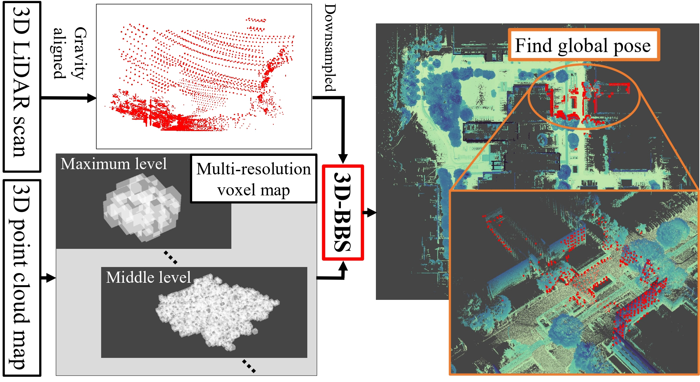
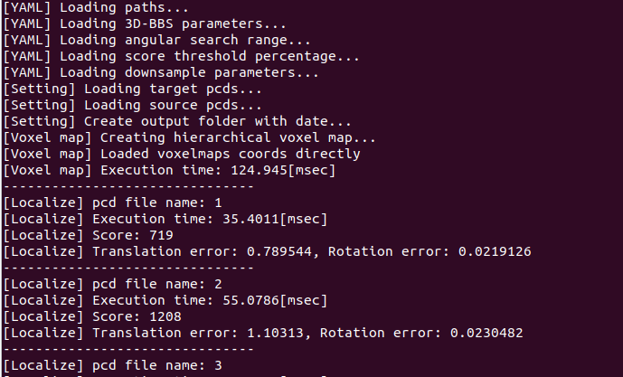
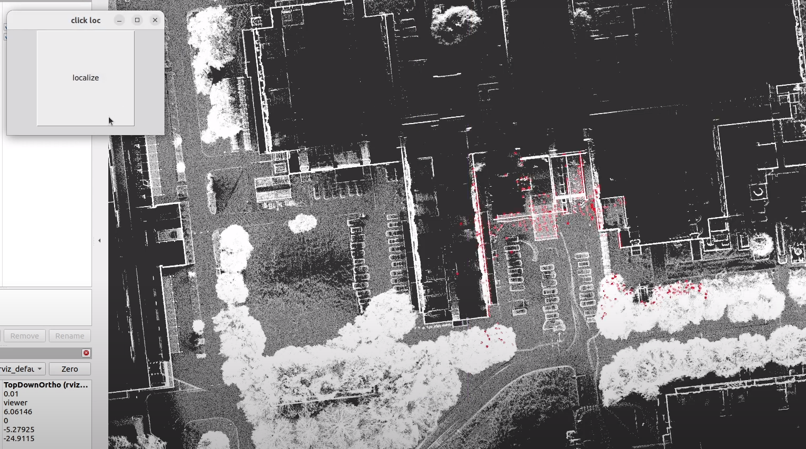

<div align="center">
  <h1>3D-BBS: Global Localization for 3D Point Cloud Scan Matching Using Branch-and-Bound Algorithm</h1>
  <br>
  <p>This repository contains the public source code for the paper to be published at ICRA2024 in Yokohama.</p>
  <p>If you like the 3D-BBS, we kindly ask for your support by giving our repository star ⭐!</p>
  <p><a href="https://arxiv.org/abs/2310.10023"><b>📄  Paper</b></a> | <a href="https://youtu.be/QGxnDnwkG1k"><b>🎞️ Video</b></a></p>
</div>

```
@inproceedings{aoki20243dbbs,
  title={3D-BBS: Global Localization for 3D Point Cloud Scan Matching Using Branch-and-Bound Algorithm}, 
  author={Koki Aoki and Kenji Koide and Shuji Oishi and Masashi Yokozuka and Atsuhiko Banno and Junichi Meguro},
  booktitle={IEEE International Conference on Robotics and Automation},
  year={2024},
  organization={IEEE}
}
```

## 🔍 Quick understanding about 3D-BBS


### Task
- 3D global localization for such as robot's initial pose estimation

### Input
  - A single 3D LiDAR scan aligned in the gravity direction by using such as IMU   
  (Although 3D-BBS also performs 6DoF search without gravity aligning, the processing time is more than 10 times longer.)
  - 3D pre-built point cloud map

### Output
- $4\times4$ transformation matrix about coarse sensor pose in map coordinates.

### Main Features 
- **Full search algorithm** based on branch-and-bound (BnB) scan matching
- **Fast processing (latest: about 20 ms ~)** by proposed GPU-accelerated BnB and roto-translational branching
- **No initial pose** (we assume that the roll and pitch angles are roughly estimated by IMU for faster processing)
- **Low voxelmap memory consumption** due to sparse hash map

### Other Features
<details><summary> Click here! </summary><div>

- Optional **Voxelmap pre-construction** and direct read function
- Optional **timeout** function
- **Minimal dependencies** in core source code so that user can **easily integrate** into the other projects
- **Docker support** by @Taeyoung96
- **Test data** is available, allowing evaluation of localization error and processing time.
- **ROS2 implementation example**
</div></details>


## 📣 News
The latest implementation demonstrates faster processing time than our paper. 
Performance on our test data:
- Hierarchical voxelmap construction
  - Paper: 9,272 ms on average
  - **Latest**: 3,494 ms on average
  - **Load saved voxelmaps directly**: 130 ms on average (See [step 5 on this page](./test/test_code.md) to save voxelmaps)
- Global localization
  - Paper: 878 ms on average
  - **Latest**: **189 ms** on average  

The hardware configuration (Intel Core i7-10700K 3.8GHz, 32GB RAM, and NVIDIA GeForce RTX2060) is the same as in the paper.

## ✅ Dependencies
- bbs3d (Lower versions are not tested)
  - CMake
  - Eigen3 (3.4.0 or higher)
  - OpenMP
  - CUDA (12.0 or higher)
- test
  - (All bbs3d dependencies)
  - PCL
- ros2_test
  - (All bbs3d dependencies)
  - ros2 humble

### Support Docker 🐳 

If nvidia driver is 525.60.11 or higher, try docker!  
For more information, you can check [docker_start.md](./docker/docker_start.md)  

## 🌟 3D-BBS core source code
### Build and Install
```shell script
# Note: If you are using Eigen3 below 3.4.0, git clone with --recursive
git clone https://github.com/KOKIAOKI/3d_bbs.git
cd 3d_bbs
mkdir build && cd build
```

- CPU ver. & GPU ver. (Please ignore the large number of warnings)
```shell script
cmake .. -DCMAKE_BUILD_TYPE=Release
make -j
sudo make install
```

- CPU ver. only
```shell script
cmake .. -DCMAKE_BUILD_TYPE=Release -DBUILD_CUDA=OFF
make -j
sudo make install
```


## 📋 Test code
See [test_code.md](./test/test_code.md)  


## 🤖 ROS 2 test code
See [ros2_test_code.md](./ros2_test/ros2_test_code.md)  



## 💻 Use 3D-BBS in your cmake project
<details><summary> Click here! </summary><div>

1. Copy `test/cmake` to your project directry
1. Copy description above `# Common include directories` in `test/CMakeLists.txt` to `your CMakeLists.txt`
1. Add either of the following depending on your implementation  
If you use the CPU version, replace `gpu` with `cpu`.
```
find_package(Eigen3 REQUIRED)
target_include_directories(yours ${EIGEN3_INCLUDE_DIR} ${gpu_bbs3d_LIBRARY})
```
</div></details>


## 🌈 Acknowledgement
I sincerely appreciate the authors for generously sharing their public code.  
[hdl_global_localization](https://github.com/koide3/hdl_global_localization)  
[cartographer](https://github.com/cartographer-project/cartographer)  
[TEASER-plusplus](https://github.com/MIT-SPARK/TEASER-plusplus)   