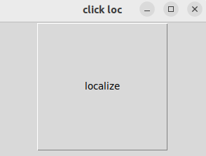
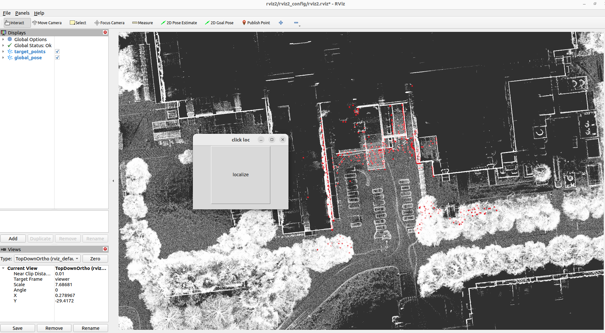
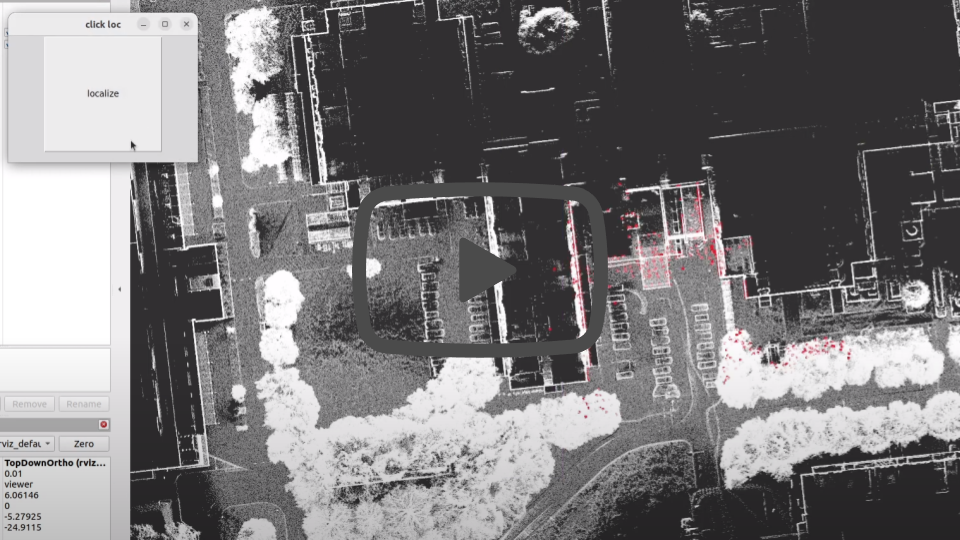
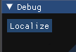
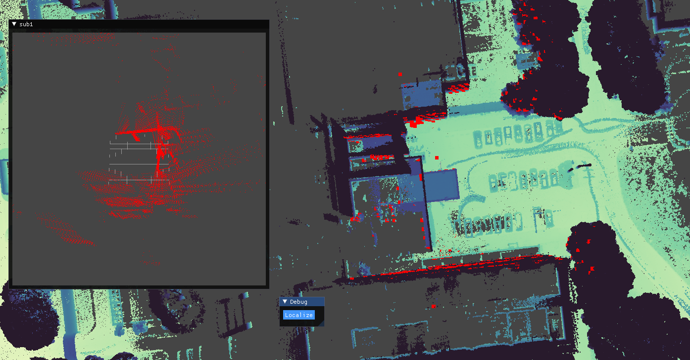
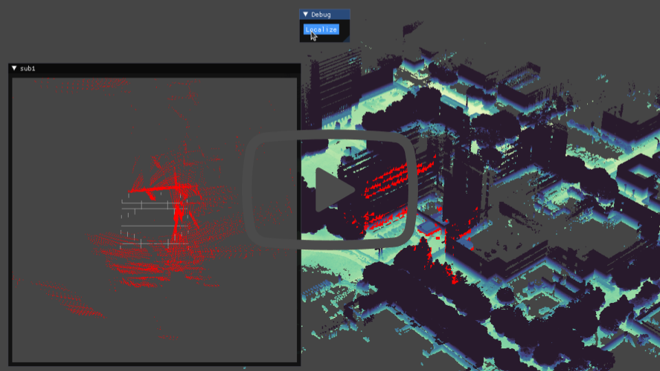

# ROS 2 Test code
Experiance the real-time global localization visually!

## Test
You can try 3D-BBS with two different viewers, Rviz2 and Iridescence.  
Note: 
- This is only supported on GPU
- Docker is not yet supported.

## A. Rviz2
### Procedure
<details><summary> Click here! </summary><div>

## Dependencies
- Installed 3D-BBS
- ROS 2 humble

### 1. Build
- Build ros2_test_rviz2 and click_loc
```shell script
cd 3d_bbs/ros2_test
colcon build --symlink-install --cmake-args -DCMAKE_BUILD_TYPE=Release --packages-select ros2_test_rviz2 click_loc
```

### 2. Config file setting
Config file format is 3d_bbs/ros2_test/config/ros2_test.yaml

Please download [test data](https://drive.google.com/file/d/1JfdQjQ3-4qOmHtvYq8UafBCmbz45-F4Z/view?usp=drive_link) and copy **target** folder path to **target_clouds** in yaml file.
```yaml
## Folder Paths
target_clouds: "your_path/target"
...
```

The ros2_test_data you download in the next step will work with default parameter values.

### 3. Run
**1. First terminal**  
```shell script
cd 3d_bbs/ros2_test
source install/setup.bash
ros2 launch ros2_test_rviz2 gpu_ros2_test_rviz2_launch.py
```

**2. Second terminal**  
Please download [ros2_test_data](https://drive.google.com/file/d/1dmyTtV4XRKNn3Z0xUyRNHqmwnaTXvsiz/view?usp=drive_link).
```shell script
ros2 bag play <ros2 bag file path>
```

**3. Wait until this message is displayed.**  
```shell script
 *=*=*=*=*=*=*=*=*=*=*=*=*=*=*=*
    [ROS2] 3D-BBS initialized
 *=*=*=*=*=*=*=*=*=*=*=*=*=*=*=*
```
**4. Click the localize button**  


Localizer uses the LiDAR scan taken just before the button click.  
The red point cloud is the matched source point.  



**5. (Optional) Load voxelmap coordinates directly**  
You can save the voxelmaps coordinates and skip 3D-BBS voxel construction if you reuse the same parameters of `min_level_res` and `max_level`.  
Please refer to step 5 of [test_code.md](./test/test_code.md)  
After saving the voxelmaps, please try 3. Run again.

</div></details>

### Silent tutorial video
[](https://youtu.be/AmQ1u77ws-g)

## B. Iridescence
### Procedure
<details><summary> Click here! </summary><div>

## Dependencies
- [Iridescence](https://github.com/koide3/iridescence)
- Installed 3D-BBS
- ROS 2 humble

### 1. Build and install
- Build and Install Iridescence
Clone repository at Home directory.
```shell script
# Install dependencies
sudo apt-get install -y libglm-dev libglfw3-dev libpng-dev libjpeg-dev libeigen3-dev libboost-filesystem-dev libboost-program-options-dev

# Build and install Iridescence
git clone https://github.com/koide3/iridescence --recursive
mkdir iridescence/build && cd iridescence/build
cmake ..
make -j8
sudo make install
```

- Build ros2_test_iridescence
```shell script
cd 3d_bbs/ros2_test
colcon build --symlink-install --cmake-args -DCMAKE_BUILD_TYPE=Release --packages-select ros2_test_iridescence
```

### 2. Config file setting
Config file format is 3d_bbs/ros2_test/config/ros2_test.yaml  

Please download [test data](https://drive.google.com/drive/folders/1V7B22oEM2HTE5__MP6uVLjLUzDR3B3Kn?usp=drive_link) and copy **target** folder path to **target_clouds** in yaml file.
```yaml
## Folder Paths
target_clouds: "your_path/target"
...
```

The ros2_test_data you download in the next step will work with default parameter values.
 
### 3. Run
**1. First terminal**  
```shell script
cd 3d_bbs/ros2_test
source install/setup.bash
ros2 launch ros2_test_iridescence gpu_ros2_test_iridescence_launch.py
```

**2. Second terminal**  
Please download [ros2_test_data](https://drive.google.com/file/d/1dmyTtV4XRKNn3Z0xUyRNHqmwnaTXvsiz/view?usp=drive_link).
```shell script
ros2 bag play <ros2 bag file path>
```

**3. Wait until this message is displayed.**  
```shell script
 *=*=*=*=*=*=*=*=*=*=*=*=*=*=*=*
    [ROS2] 3D-BBS initialized
 *=*=*=*=*=*=*=*=*=*=*=*=*=*=*=*
```
**4. Click the localize button**  


Localizer uses the LiDAR scan taken just before the button click.  
The red point cloud is the matched source point.  
By pressing "Ctrl+M", a hidden menu bar appears.



**5. (Optional) Load voxelmap coordinates directly**  
You can save the voxelmaps coordinates and skip 3D-BBS voxel construction if you reuse the same parameters of `min_level_res` and `max_level`.  
Please refer to step 5 of [test_code.md](./test/test_code.md)
After saving the voxelmaps, please try 3. Run again.

</div></details>

### Silent tutorial video
[](https://youtu.be/k2DZ2q2ZhOs)

## Conditions for demonstrating 3D-BBS performance on your own data
- Keep the robot with the sensor stationary.
  - Reason: The error in the direction of gravitational acceleration estimated by IMU increases while the robot is running.
  - Although the roll and pitch searches can be expanded, processing time will increase.
- Use only at locations where the source point cloud is completely included in the target point cloud.
  - Reason: Another pose that encompasses all source point cloud is estimated when the source point cloud includes outside the map environment. 
  - Please use the downsampling and point cloud cutting tools.