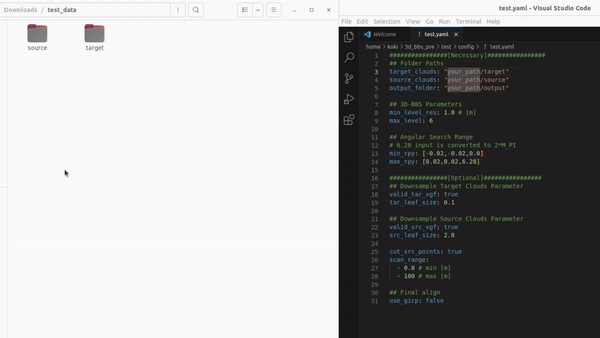

# Test code

## Dependencies
- (All bbs3d dependencies)
- PCL

## Test
### 1. Build
```shell script
cd 3d_bbs/test/
mkdir build && cd build
```

- CPU ver. & GPU ver.
```shell script
cmake .. -DCMAKE_BUILD_TYPE=Release
make -j8
```

- CPU ver. only  
```shell script
cmake .. -DCMAKE_BUILD_TYPE=Release -DBUILD_CUDA=OFF
make -j8
```

### 2. Download
Please download [test data](https://drive.google.com/file/d/1JfdQjQ3-4qOmHtvYq8UafBCmbz45-F4Z/view?usp=drive_link).

### 3. Config file setting
Config file format is **3d-bbs/test/config/test.yaml**  
Please edit the config file as below:
1. Copy the **target** and **source** paths in the downloaded test_data to **target_clouds** and **source_clouds** items.
1. Create the output folder where you want to save the output pcd and copy the path to **output_folder** in test.yaml.
1. Test data work with default parameter values.  



### 4. Run
- GPU
```
cd 3d_bbs/test/build/
./gpu_test <config_file_path>
```

- CPU
```
cd 3d_bbs/test/build/
./cpu_test <config_file_path>
```

## 5. (Optional) Load voxelmap coordinates directly
You can save the voxelmaps coordinates and skip 3D-BBS voxel construction if you reuse the same parameters of `min_level_res` and `max_level`.
```
cd 3d_bbs/test/build/
./saver <target folder path> min_level_res max_level 
```
Then, try again 4.Run. Voxelmaps coordinates in 'voxelmaps_coords' are automatically loaded.  
Note: Test code preferentially uses the parameters in the generated text file 'voxel_params.txt'.

## Using your own 3D point cloud map and LiDAR scan data
### Convert ros2 bag to pcd file
If you have your own ros2 bag data, you can convert LiDAR msgs to pcd file with package below so that point cloud aligns in the direction of gravitational acceleration using IMU msgs.  
https://github.com/KOKIAOKI/ros2bag_to_pcd

### Conditions for demonstrating 3D-BBS performance on your own data
- Keep the robot with the sensor stationary.
  - Reason: The error in the direction of gravitational acceleration estimated by IMU increases while the robot is running.
  - Although the roll and pitch searches can be expanded, processing time will increase.
- Use only at locations where the source point cloud is completely included in the target point cloud.
  - Reason: Another pose that encompasses all source point cloud is estimated when the source point cloud includes outside the map environment. 
  - Please use the downsampling and point cloud cutting tools.
